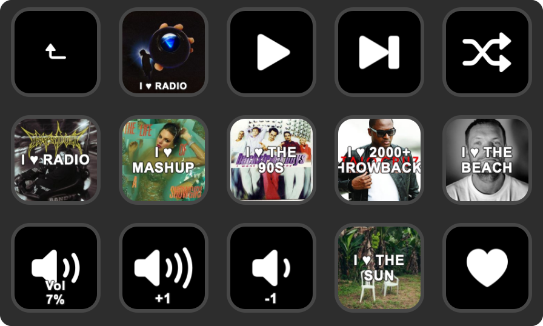
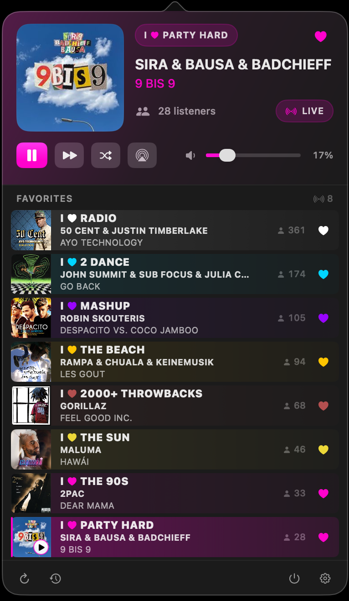
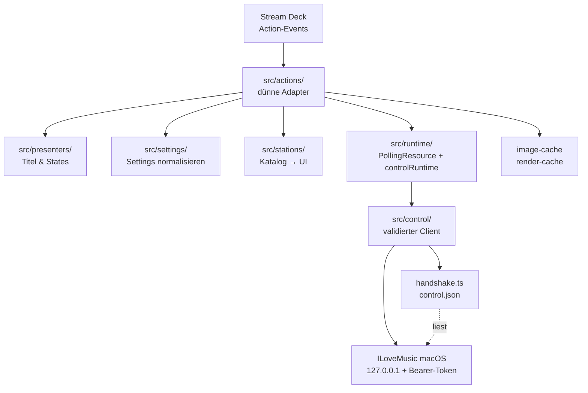

<div align="center">

# ILoveMusic für Stream Deck

**Stream-Deck-Plugin für die ILoveMusic-Menüleisten-App unter macOS.**
<br>
Wiedergabe, Sender, Favorit und Lautstärke auf den Tasten – über einen lokalen, token-gesicherten Control-Kanal. Kein Account, keine Cloud, kein eigenes Backend.

[](https://www.elgato.com/stream-deck)
[](https://www.apple.com/macos/)
[](https://www.typescriptlang.org/)
[](https://nodejs.org/)
[](#tests)
[](LICENSE)

[Überblick](#überblick) • [Installation](#installation) • [Actions](#actions) • [Verbindung](#verbindung) • [Control-Protokoll](#control-protokoll) • [Architektur](#architektur) • [Entwicklung](#entwicklung) • [Release](#release)



</div>

## Überblick

Dieses Plugin steuert die **ILoveMusic-App für macOS** vom Stream Deck aus. Es bringt acht Actions mit: Play/Pause, nächster Sender, Zufallssender, Sender wählen, Now Playing mit Live-Cover, Favorit, Lautstärke und Lautstärke-Schritt.

Das Plugin bleibt bewusst **dünn**. Es hält keine Streams, kennt keine Senderlogik und speichert keinen abgeleiteten Zustand: Wiedergabe, Katalog, Favoriten und Lautstärke gehören der macOS-App. Das Plugin liest ihren Zustand und schickt Kommandos – über `127.0.0.1`, mit einem Bearer-Token, das die App bei jedem Start neu vergibt.

- **App-first** – die macOS-App ist die einzige Quelle der Wahrheit, das Plugin nur eine Fernbedienung.
- **lokal-first** – die gesamte Kommunikation läuft über Loopback; nichts verlässt den Rechner.
- **zustandsarm** – abgeleitete Senderdaten liegen nicht in den Action-Settings, sondern kommen bei jedem Poll frisch aus dem Katalog.
- **validiert** – jede Handshake- und HTTP-Antwort wird dekodiert und geprüft, bevor Action-Code sie sieht.

> Inoffizielles Hobbyprojekt ohne Verbindung zu I Love Music GmbH.

## Voraussetzungen

| | |
| --- | --- |
| **Stream Deck Software** | 6.5 oder neuer (`Software.MinimumVersion` im Manifest) |
| **macOS** | 14 oder neuer – dieselbe Untergrenze wie die ILoveMusic-App, ohne die das Plugin nichts steuern kann |
| **Node.js** | 20 – die Laufzeit, mit der Stream Deck das Plugin startet (`Nodejs.Version`) |
| **ILoveMusic für macOS** | zwingend erforderlich, muss laufen |

### Die Begleit-App

<div align="center">

</div>

Ohne die App tut das Plugin nichts – sie betreibt den lokalen Control-Server, den das Plugin anspricht. Alle Tasten zeigen dann `Offline`.

**App-Repository: [nichtlegacy/ilovemusic-macos](https://github.com/nichtlegacy/ilovemusic-macos)**

## Installation

1. ILoveMusic für macOS installieren und starten. Der Control-Server läuft automatisch, solange die App aktiv ist.
2. Die Datei `de.nichtlegacy.ilovemusic.streamDeckPlugin` aus den [Releases](https://github.com/nichtlegacy/ilovemusic-streamdeck/releases) herunterladen.
3. Doppelklick darauf – die Stream Deck Software übernimmt die Installation.
4. Im Stream-Deck-Editor die Kategorie **ILoveMusic** öffnen und Actions auf Tasten ziehen.
5. Bei *Select Channel*, *Random Channel*, *Now Playing*, *Volume* und *Volume Step* im Property Inspector die Einstellungen setzen.

Läuft die App, füllen sich die Tasten innerhalb weniger Sekunden mit Titel, Zustand und Cover.

## Actions

Acht Actions, alle als **Keypad**-Tasten. *Now Playing* und *Volume* sind bewusst nicht in Multi-Actions verfügbar, weil sie ein laufendes Tastenbild rendern.

| Action | Taste zeigt | Tastendruck | Einstellungen |
| --- | --- | --- | --- |
| **Play / Pause** | Play- oder Pause-Symbol; Titel `…` beim Puffern, `Recon` beim Reconnect, `Error` bei Fehler | `POST /v1/toggle` | – |
| **Next Channel** | statisches Symbol | `POST /v1/next` | – |
| **Random Channel** | statisches Symbol, Titel `Fav` wenn auf Favoriten begrenzt | `POST /v1/random` | **Channel Pool**: alle Sender · nur Favoriten |
| **Select Channel** | Name des konfigurierten Senders (bis zu drei Zeilen) und sein Katalog-Cover als Tastenbild | `POST /v1/select` | **Channel**: Auswahlliste, live aus der laufenden App geladen |
| **Now Playing** | Live-Cover des laufenden Titels, darunter wahlweise Sendername und Künstler/Titel | `POST /v1/toggle` | **Channel Name** (an) · **Song Info** (aus) |
| **Favorite** | gefülltes oder leeres Herz für den laufenden Sender; `No Chan` ohne Sender | `POST /v1/favorite` | – |
| **Volume Step** | Pfeil hoch/runter, Titel `+5 %` bzw. `-5 %` | `POST /v1/volume/step` | **Direction**: lauter · leiser — **Step Size**: 1/5/10/15/20 % (Standard 5) |
| **Volume** | aktueller Pegel in Prozent, stumm-/nicht-stumm-Symbol | `POST /v1/mute` (umschalten) | **Label**: `Vol`-Präfix (aus) · **Large Value**: gestapelte Prozentanzeige (aus) |

Ist die App nicht erreichbar, tragen alle zustandsbehafteten Tasten den Titel `Offline`. Bei *Select Channel* steht `Unknown`, wenn der konfigurierte Sender nicht mehr im Katalog ist – eine konfigurierte Taste bleibt nie leer.

Scheitert ein Tastendruck, zeigt die Taste Stream Decks Alarm-Symbol statt still zu versagen.

<details>
<summary><b>Property Inspectors</b></summary>

<br>

Die Property Inspectors liegen als lokale HTML-Dateien unter `de.nichtlegacy.ilovemusic.sdPlugin/ui/`. Es gibt keine CDN-Abhängigkeit zur Laufzeit: `ui/shared/pi.js` implementiert die kleine WebSocket-Brücke, die die Inspectors für Settings und `sendToPlugin` brauchen, `ui/shared/pi.css` das Styling.

| Datei | Action |
| --- | --- |
| `ui/random.html` | Random Channel |
| `ui/select-channel.html` | Select Channel |
| `ui/now-playing.html` | Now Playing |
| `ui/volume.html` | Volume |
| `ui/volume-step.html` | Volume Step |

Die Senderliste in *Select Channel* wird nicht im Plugin gespeichert: Der Inspector schickt beim Öffnen `{ event: "getStations" }`, das Plugin aktualisiert daraufhin den Katalog und antwortet mit den Einträgen. Ist die App offline, steht ein deaktivierter Hinweis in der Liste.

</details>

## Verbindung

Die macOS-App hält **keine** dauerhafte Verbindung zum Stream Deck offen. Sie startet einen lokalen HTTP-Server auf einem zufälligen Port und legt einen Handshake ab:

```json
{ "port": 51234, "token": "…", "version": 2 }
```

Das Plugin sucht die Datei in dieser Reihenfolge und nimmt die erste lesbare:

```text
~/Library/Application Support/ILoveMusic/control.json
~/Library/Application Support/I Love Music/control.json
~/Library/Application Support/ILOVEMusicMenubar/control.json
```

Danach spricht es `http://127.0.0.1:<port>` mit `Authorization: Bearer <token>` an.

### Absicherung

- Der Server bindet ausschließlich auf **Loopback** (`127.0.0.1`), nie auf eine externe Schnittstelle.
- Das **Bearer-Token** wird bei jedem App-Start neu erzeugt und im Konstantzeit-Vergleich geprüft.
- Eine **Host-Header-Prüfung** wehrt DNS-Rebinding ab: alles außer `127.0.0.1:<port>` und `localhost:<port>` bekommt `403`.
- Die Handshake-Datei hat Modus `0600` und wird beim Beenden gelöscht.

### Polling und Frische

| Ressource | Intervall |
| --- | --- |
| `GET /v1/state` | alle **3 s** |
| `GET /v1/stations` | alle **30 s** |
| Request-Timeout | **4 s** pro Request |
| Offline-Karenz | **15 s** nach der letzten guten Antwort |

Gepollt wird nur, solange mindestens eine passende Taste sichtbar ist. Fällt eine Antwort aus, bleibt der letzte Wert innerhalb der Karenzzeit als `stale` stehen – die Tasten flackern nicht bei einem einzelnen Aussetzer. Erst danach wechseln sie auf `offline`.

Nach einem Tastendruck wird der Zustand **erzwungen** neu geladen: Ein bereits laufender Request wurde vor der Änderung abgeschickt und würde den alten Stand melden, deshalb wird er abgewartet und danach frisch gefragt.

### Wenn die App neu startet

Port und Token wechseln bei jedem App-Start. Das Plugin erkennt beides:

- Bei `401`/`403` oder einem Transportfehler (abgelehnte Verbindung, Timeout) verwirft es den gecachten Handshake.
- **Lesende Requests** werden danach genau einmal mit frisch gelesenem Handshake wiederholt.
- **Schreibende Requests** werden nie automatisch wiederholt – ein doppelter Sprung zum nächsten Sender wäre schlimmer als ein fehlgeschlagener. Der Handshake wird trotzdem verworfen, sodass der nächste Request die App wiederfindet.

Ist die App gar nicht gestartet, existiert keine Handshake-Datei und das Plugin meldet `ILoveMusic app not running`.

<details>
<summary><b>Weitere Robustheitsdetails</b></summary>

<br>

- **Sofortiges Zeichnen.** `subscribe` reicht den aktuellen Snapshot nur an den gerade registrierten Listener – den es nur für die erste sichtbare Taste gibt. Jede weitere Taste, und jede nach einem Seitenwechsel zurückkehrende, wird direkt aus dem Snapshot im Speicher gezeichnet statt bis zum nächsten Poll die Manifest-Vorgabe zu zeigen.
- **Render-Cache.** Titel, State und Bild werden nur geschrieben, wenn sie sich ändern. Verschwindet eine Taste, wird ihr Cache-Eintrag verworfen, sonst würde eine zurückkehrende Taste gegen einen Wert vergleichen, den Stream Deck nicht mehr anzeigt.
- **Cover-Cache.** Gleiche URLs werden nicht erneut geladen, gleichzeitige Anfragen auf dieselbe URL zu einer zusammengefasst, und eine tote URL bekommt **60 s** Backoff statt bei jedem 3-Sekunden-Poll erneut in ein 4-Sekunden-Timeout zu laufen.
- **Kein Überschreiben durch späte Bilder.** Ein langsamer Cover-Download für den vorigen Titel wird verworfen, statt Titel und Bild des neuen zu überschreiben.
- **Eingegrenzte Fehler.** Ein fehlgeschlagener Render betrifft nur die verursachende Taste; die übrigen behalten ihre guten Daten. Nicht abgewartete Renders werden geloggt statt den Plugin-Prozess über eine unbehandelte Promise-Rejection zu beenden.
- **Kein N+1.** `volume` und `muted` kommen kanonisch aus `/v1/state`. Der defensive Rückfall auf `/v1/volume` ist über alle sichtbaren Volume-Tasten dedupliziert und für **2,5 s** gemerkt.

</details>

## Control-Protokoll

Alle Requests brauchen `Authorization: Bearer <token>` aus `control.json`. Serverseitig implementiert in [`ControlServer.swift`](https://github.com/nichtlegacy/ilovemusic-macos/blob/main/Sources/ILoveMusic/Services/ControlServer.swift).

| Methode | Pfad | Body | Antwort |
| --- | --- | --- | --- |
| `GET` | `/v1/state` | – | `{ phase, station, nowPlaying, favorite, volume, muted }` |
| `GET` | `/v1/stations` | – | `[{ id, name, iconURL }]` |
| `GET` | `/v1/volume` | – | `{ volume, muted }` |
| `POST` | `/v1/toggle` | – | `204` |
| `POST` | `/v1/play` | – | `204` |
| `POST` | `/v1/pause` | – | `204` |
| `POST` | `/v1/next` | – | `204` |
| `POST` | `/v1/random` | optional `{ "favoritesOnly": true }` | `204`, `409` wenn kein Sender gefunden wird |
| `POST` | `/v1/select` | `{ "stationId": "…" }` | `204` |
| `POST` | `/v1/favorite` | – | `204` |
| `POST` | `/v1/volume` | `{ "volume": 0…100 }` | `204` |
| `POST` | `/v1/volume/step` | `{ "delta": … }` | `204` |
| `POST` | `/v1/mute` | ohne Body umschalten, `{ "muted": true }` setzt explizit | `204` |

`phase` ist einer von `idle`, `buffering`, `playing`, `paused`, `reconnecting`, `failed`.

Statuscodes: `400` bei fehlendem `Host`-Header oder ungültigem Body · `401` ohne gültiges Token · `403` bei unpassendem `Host`-Header · `404` bei unbekannter Route · `409` wenn `/v1/random` keinen Sender findet · `413` bei einem Body über 64 KiB · `431` bei überlangen Headern.

## Architektur



| Schicht | Verantwortung | Ort |
| --- | --- | --- |
| **Actions** | eine Klasse je Action, nur Event-Anbindung und Rendern | [`src/actions/`](src/actions) |
| **Runtime** | Poll-Takt, Frische, Offline-Karenz, Volume-Auflösung | [`src/runtime/`](src/runtime) |
| **Control** | HTTP-Client, Handshake-Cache, Contracts/Decoder, Fehlertypen | [`src/control/`](src/control) |
| **Presenters** | leitet Tastentitel und States aus dem Zustand ab | [`src/presenters/`](src/presenters) |
| **Settings** | normalisiert rohe Stream-Deck-Payloads auf stabile interne Werte | [`src/settings/`](src/settings) |
| **Stations** | Katalog zu Auswahllisten und Tastendaten | [`src/stations/`](src/stations) |
| **Caches** | Cover-Download als `data:`-URL, Render-Deduplizierung | [`src/image-cache.ts`](src/image-cache.ts) · [`src/render-cache.ts`](src/render-cache.ts) |

Actions halten keine eigenen Timer und keine eigene Meinung zur Erreichbarkeit – beides gehört der geteilten Runtime.

## Entwicklung

```bash
git clone https://github.com/nichtlegacy/ilovemusic-streamdeck.git
cd ilovemusic-streamdeck

npm install
npx streamdeck link de.nichtlegacy.ilovemusic.sdPlugin
npm run watch
```

`npm run watch` baut bei jeder Änderung neu und startet das Plugin anschließend über die lokal installierte CLI (`node_modules/.bin/streamdeck`) neu.

| Befehl | Zweck |
| --- | --- |
| `npm run typecheck` | `tsc --noEmit` |
| `npm test` | Testlauf (siehe [Tests](#tests)) |
| `npm run build` | Bundle nach `de.nichtlegacy.ilovemusic.sdPlugin/bin/plugin.js` |
| `npm run watch` | Build im Watch-Modus mit automatischem Plugin-Neustart |
| `npm run package` | `Scripts/package.sh`: Version prüfen, bauen, `.streamDeckPlugin` packen |
| `npm run version:sync` | Manifest-Version aus `package.json` schreiben |
| `npm run version:check` | fehlschlagen, wenn Manifest und `package.json` auseinanderlaufen |

Gebaut wird mit [rolldown](https://rolldown.rs/) ([`rolldown.config.ts`](rolldown.config.ts)); Laufzeit-Abhängigkeiten sind nur `@elgato/streamdeck` und `@elgato/utils`.

### Tests

**25 Tests** über sechs Dateien unter [`tests/`](tests). Der Harness wird mit rolldown nach `.test-dist/run.js` gebündelt und mit Node ausgeführt – kein Test-Framework als Abhängigkeit.

```bash
npm test
```

Abgedeckt: Contract-Dekodierung und Clamping, Retry-Verhalten des Control-Clients (inklusive „Mutationen werden nicht wiederholt"), Handshake-Invalidierung, Cover-Cache mit Dedup und Failure-Backoff, Frischezustände der `PollingResource`, erzwungene Refreshes nach Mutationen, Volume-Fallback-Dedup sowie Presenter- und Settings-Logik.

### Lokalen Build installieren

```bash
npm run package
open dist/de.nichtlegacy.ilovemusic.streamDeckPlugin
```

Alternativ über die CLI:

```bash
npx streamdeck install dist/de.nichtlegacy.ilovemusic.streamDeckPlugin
```

`Scripts/package.sh` prüft vorher `npm run version:check`, baut neu, entfernt `.DS_Store`-Reste aus dem Plugin-Ordner und legt das Paket unter `dist/` ab.

## Release

**`package.json` ist die einzige Versionsquelle.** Elgato verlangt eine vierteilige Version, deshalb trägt das Manifest die Paketversion plus ein Build-Segment (`0.1.0` → `0.1.0.0`). Ein vorhandenes Build-Segment bleibt erhalten, sodass ein Neubau derselben Freigabe als `0.1.0.1` veröffentlicht werden kann, ohne `package.json` anzufassen.

`npm run version:check` schlägt fehl, sobald beide auseinanderlaufen – lokal in `Scripts/package.sh` und in beiden Workflows.

<details>
<summary><b>CI und Release-Workflow</b></summary>

<br>

**[`ci.yml`](.github/workflows/ci.yml)** – bei jedem Push auf `main`, jedem Pull Request und manuell. Läuft auf `ubuntu-24.04` mit Node 20: `npm ci` → `version:check` → `typecheck` → `test` → `Scripts/package.sh` → `.streamDeckPlugin` als Artefakt. macOS ist dafür nicht nötig, weil das Plugin reines TypeScript ist und `streamdeck pack` eine Node-CLI. Alle Actions sind auf Commit-SHAs gepinnt.

**[`release.yml`](.github/workflows/release.yml)** – ausgelöst von einem `v*`-Tag, alternativ manuell mit einem vorhandenen Tag. Der Workflow prüft zuerst, dass der Tag zur Version in `package.json` passt (`v0.1.0` ↔ `0.1.0`), läuft dann durch Typecheck, Tests und Packaging und veröffentlicht das `.streamDeckPlugin` als GitHub-Release. Gibt es `.github/release-notes/<version>.md`, wird diese Datei als Release-Text verwendet, sonst generiert `gh` die Notizen.

Ein Release schneiden:

```bash
npm version 0.2.0 --no-git-tag-version
npm run version:sync
git commit -am "chore(release): v0.2.0"
git tag v0.2.0
git push && git push --tags
```

</details>

## Projektstruktur

```text
ilovemusic-streamdeck/
├── package.json                 # einzige Versionsquelle, npm-Skripte
├── rolldown.config.ts           # Plugin-Bundle (+ Neustart im Watch-Modus)
├── rolldown.tests.config.ts     # Test-Bundle nach .test-dist/
├── tsconfig.json
├── .github/
│   ├── workflows/ci.yml         # Typecheck, Tests, Packaging bei jedem Push
│   ├── workflows/release.yml    # Veröffentlichen bei einem v*-Tag
│   └── release-notes/           # Release-Notizen je Version
├── Scripts/
│   ├── package.sh               # .streamDeckPlugin bauen und packen
│   ├── version.mjs              # Manifest-Version aus package.json
│   ├── regenerate-icons.sh      # Action-Icons neu rendern
│   └── render-sfsymbol.swift    # SF-Symbol → PNG
├── de.nichtlegacy.ilovemusic.sdPlugin/
│   ├── manifest.json            # acht Actions, SDK 2, Stream Deck 6.5+, Node 20
│   ├── bin/plugin.js            # Build-Artefakt
│   ├── imgs/                    # Plugin- und Action-Icons (@1x/@2x)
│   └── ui/                      # Property Inspectors + shared/pi.js, shared/pi.css
├── src/
│   ├── plugin.ts                # Einstiegspunkt, registriert alle acht Actions
│   ├── actions/                 # toggle, next, random, select-channel,
│   │                            # now-playing, favorite, volume-step, volume
│   ├── control/                 # client, contracts, handshake, errors
│   ├── runtime/                 # control-runtime, polling-resource
│   ├── presenters/              # Titel- und State-Ableitung
│   ├── settings/                # Settings-Normalisierung und -Cache
│   ├── stations/                # Katalog → UI
│   ├── image-cache.ts           # Cover als data:-URL, mit Dedup und Backoff
│   └── render-cache.ts          # schreibt nur, was sich geändert hat
├── tests/                       # 25 Tests, mit rolldown gebündelt
└── docs/screenshots/            # Bilder für dieses README
```

## Referenzen

- Stream Deck SDK: <https://docs.elgato.com/streamdeck/sdk/>
- Stream Deck WebSocket-UI-Referenz: <https://docs.elgato.com/streamdeck/sdk/references/websocket/ui/>
- ILoveMusic für macOS: <https://github.com/nichtlegacy/ilovemusic-macos>

## Lizenz & Haftungsausschluss

Veröffentlicht unter der [MIT-Lizenz](LICENSE) – © 2026 nichtlegacy.

Inoffizielles, nicht-kommerzielles Hobbyprojekt. „ILoveMusic" / „I Love Music" sowie Sender, Logos und Marken gehören ihren jeweiligen Inhabern; dieses Plugin steht in keiner Verbindung zu I Love Music GmbH. „Stream Deck" ist eine Marke der Elgato/Corsair.
</content>
